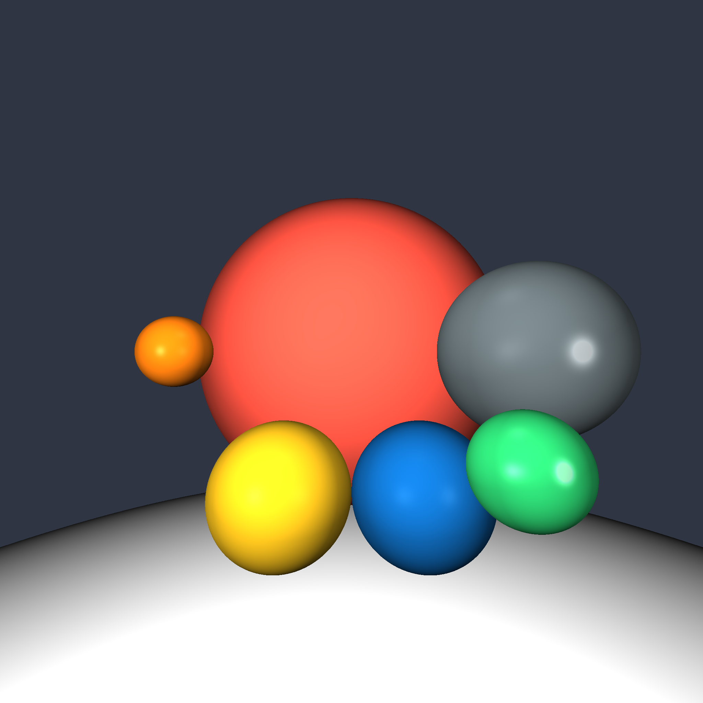
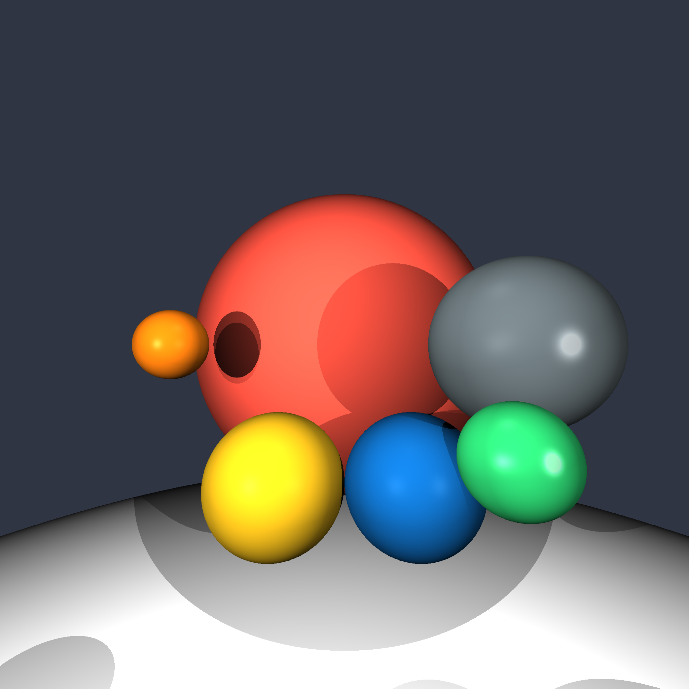
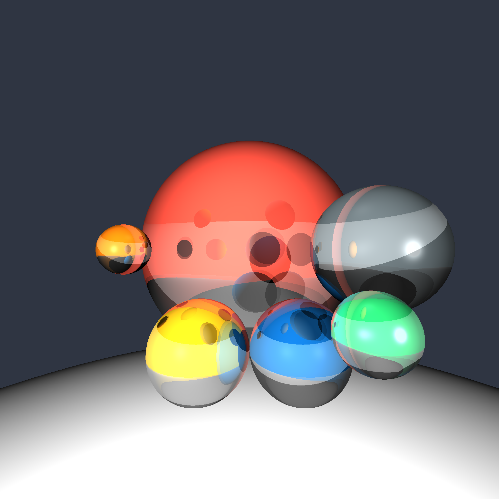
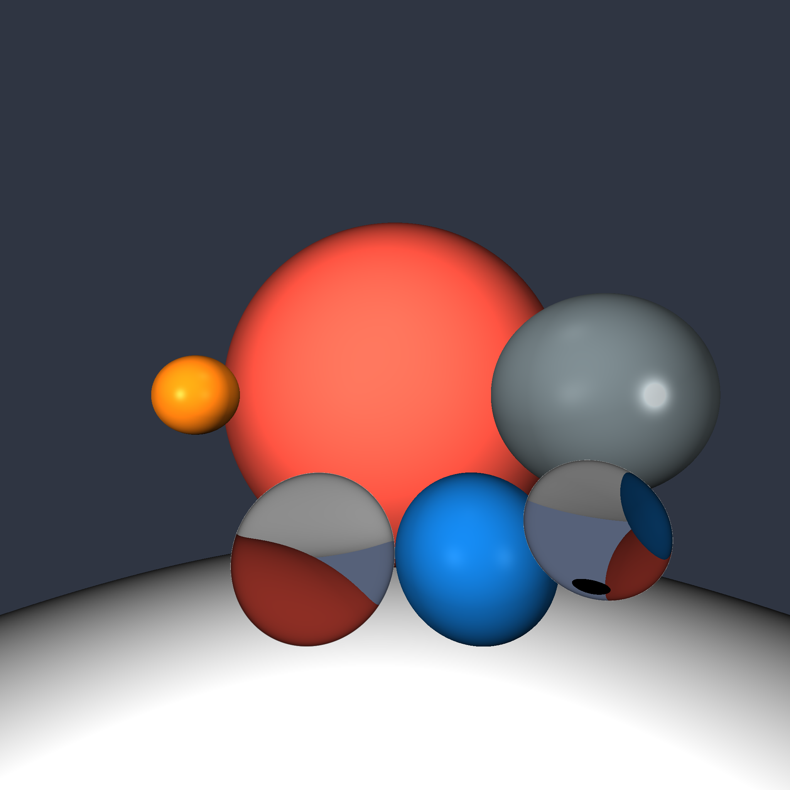

# RayTracing
The ray tracing algorithm generates photorealistic images from 3-D geometry in a scene. Ray tracers simulate the behavior of light as photons travel from a light source, collide with and bounce off of objects in the scene, and eventually reach the observer. This process can be computationally intensive depending on the scene complexity and number of light sources.

# Shading 

Lambertian

Phong

Shadows

Mirror Reflectance

Transperancy
